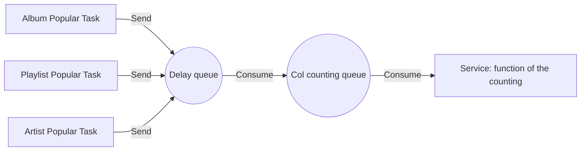

# Link Of The Consumption

## 1. Parsing DTO

Parse SendReq

Map table and field according to field tableType and fieldType respectively

## 2. Weaken the shaving of Consumption

In order not to process too much data at one time, the delay queue is used for weaken the shaving

* The popularity of Col, Music, and Video is regularly calculated for recommendation and search rankings every day
* 1000 batches, calculate the delayTime, and the time interval between each batch is 6 seconds, so that a large batch of data updates can be evenly distributed to each time window
* The message will be stored in the delay queue. Whenever the delayTime is reached, it will be sent to the count queue for consumption



## 3. Full Counting Cache
> Warm up the full counting cache for user interface display, for example: the total number of playlists is 100,000, and every time you listen to a song, it will be +1 on its basis

### 3.1 Data Structure
> Select the data structure as Hash

```Select the data structure as Hash
The key of Col:
count:all:c:{colId}

field:
collect、comment、share、stream、download、popular

value:
total value
```

```Select the data structure as Hash
The key of Music:
count:all:m:{musciId}

field:
download、collect、share、stream、popular

value:
total value
```

### 3.2 Build Process

#### 3.2.1 Data Construction

1. Assemble Redis key according to Id and Field

2. hasKey() Determines whether the key exists

3. hincrBy +1 to the number of fields

4. When the key does not exist and fieldCount=1, check the database to preheat the cached data

   ```
   if (!exist && 1 == fieldCount){
   	//query Mysql
   }
   ```

5. Renew to ensure that the hotspot data does not expire


#### 3.2.2 Data Consistency
> In principle, redis data is unreliable due to problems such as cache failure, memory recycling, and persistence strategy selection, and the data in mysql shall prevail

* The cache invalidation time is 8 hours to ensure the final consistency of the cache and database data
* Check the cache first, if not, check it from the database


