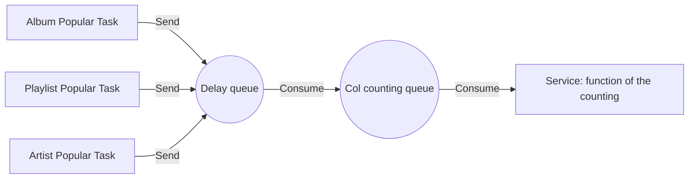

# Link Of The Consumption

## 1. Parsing DTO

Parse SendReq

Map table and field according to field tableType and fieldType respectively

## 2. Weaken the shaving of Consumption

In order not to process too much data at one time, the delay queue is used for weaken the shaving

* The popularity of Col, Music, and Video is regularly calculated for recommendation and search rankings every day
* 1000 batches, calculate the delayTime, and the time interval between each batch is 6 seconds, so that a large batch of data updates can be evenly distributed to each time window
* The message will be stored in the delay queue. Whenever the delayTime is reached, it will be sent to the count queue for consumption

