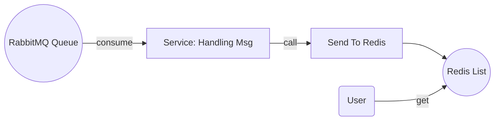

# Feed Push

## 1. Overview

```
Push is mainly used to push personalized feeds, and such feed messages will only trigger specified users

The scene is as follows:
Artist's new album release, follow, comment, application private message, etc.

Middleware: Redis, data structure: List

Users have their own exclusive message list, specific scenarios such as: entering the home page, entering the personal center, etc

Trigger the message pull operation of the user message list
```


## 2. Process



## 3. Details