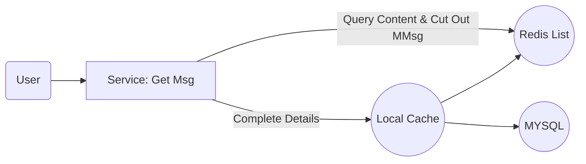

# Feed Pull

## 1. Overview

```
Pull is mainly used for system-level feed related, such feed messages almost involve most users

This method can save more message storage resources, but it will be time-consuming for users to actively pull Feed messages, and it is also a test for interface performance

If the amount of data here is not large, you can introduce local cache to optimize performance

The scene is as follows:
System messages, user group messages, activity messages, etc.
```

## 2. Process

