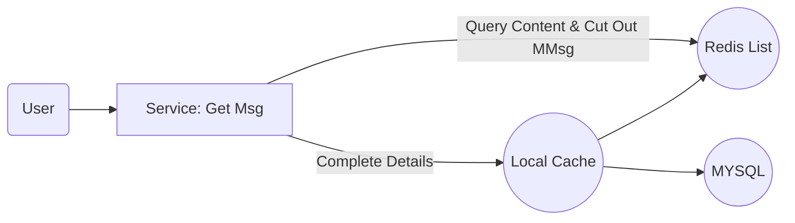
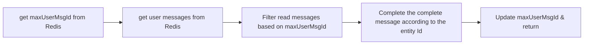
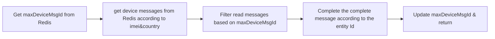

# Feed Pull

## 1. Overview

```
Pull is mainly used for system-level feed related, such feed messages almost involve most users

This method can save more message storage resources, but it will be time-consuming for users to actively pull Feed messages, and it is also a test for interface performance

If the amount of data here is not large, you can introduce local cache to optimize performance

The scene is as follows:
System messages, user group messages, activity messages, etc.
```

## 2. Process



## 3. Details

### 3.1 General Parameter

**REQ:**

```
userId				// User ID
imei				// Equipment Identity
imsi				// Equipment Identity
countryCode			// Country Code	
channel				// Channel	
maxUserMsgId		// The maximum msgId of the current user message
maxDeviceMsgId		// The maximum msgId of the current device message
```

### 3.2 General Response

**RESP:**

```
maxUserMsgId					// The maximum msgId of the current user message	
maxDeviceMsgId					// The maximum msgId of the current device message

List<PullMessage> msgList
	msgId						// Message Id	
	msgType						// Message Type
	timestamp					// timestamp
	userId						// User Id
	content						// Message Content
```

### 3.3 Get User Information



### 3.3 Get System Information

