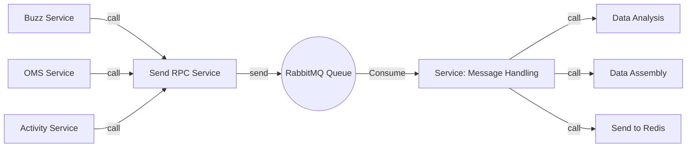

# Generate Msg

## 1. Overview

```
The service provides an RPC interface for sending messages

When the upstream service performs business operations, it uniformly calls this interface to send messages

Messages will be stuffed into different Redis Lists according to different business types
```

## 2. Process

