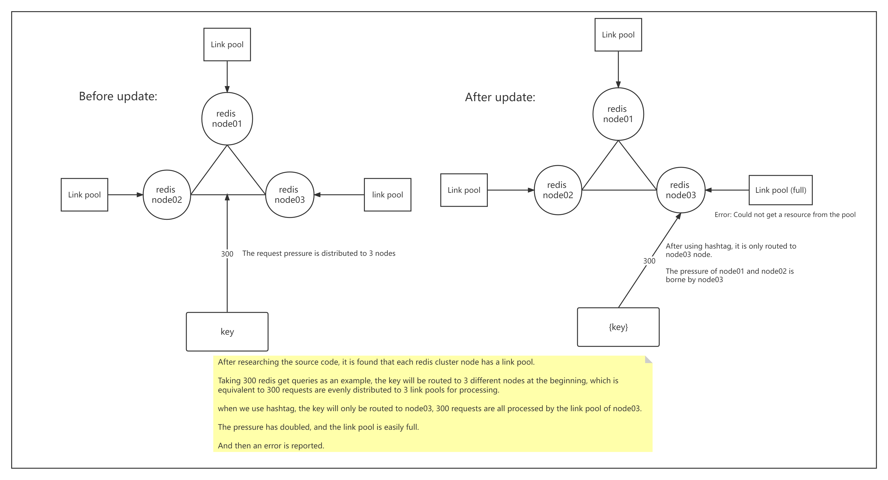

# Client error that could not get a resource from the pool

## 1. Cause & Solution

* The concurrency is indeed too high and the link pool configuration parameters are unreasonable

  Solution: 
  
  Adjust configuration parameters and expand nodes

* The Redis execution queue is occupied by a large number of operations or time-consuming operations

  Solution: 
  
  Optimize slow operations and disable slow operations

* hot key exists

  Solution: 
  
  Split the key and distribute the pressure to each redis node
  
  Increase the local memory, check the local memory first, and then go to redis if it cannot be found

* A node's link pool is exhausted

  Solution: 
  
  Solve the data skew problem

* Executing the time-consuming command causes the ping to time out

  Solution: 
  
  Disable time-consuming commands, such as: keys *
  
  Optimize time-consuming operations

* There is a bug in the Jedis package of the lower version

  Solution: 
  
  Upgrade Jedis version
  
  
## 2. Hot key scene combing

**Question 01：**

Frequent access to a certain area IP

**Solution：**

Increase application local cache and lru maintains a certain number of hot IPs

**Question 02：**

Frequently query a large Zset collection

**Solution：**

Split by key by business dimension or split by data number segment

## 3. Sorting out the scenario of a node's link pool exhaustion

> Bloody case caused by hashtag abuse

