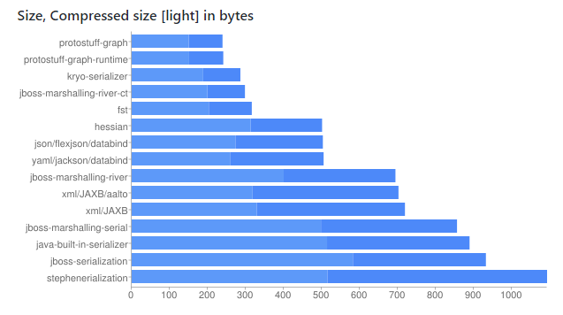

# Memory usage optimization


## 1. Utilize jemalloc memory allocation feature for optimization

In a 64-bit system, jemalloc divides the memory space into three ranges: small, large and huge

Each range is divided into many small memory block units

When Redis stores data, it will select the memory block with the most suitable size for storage

As shown in the figure：


The values are discontinuous when jemalloc allocates memory

Therefore, if the key/value string changes by one byte, it may cause a large change in memory usage. 

This can be used in design.


E.g:

If the length of the key is **8 bytes**, the SDS is 8+9=**17 bytes**, and jemalloc allocates **32 bytes**

At this time, the key length is reduced to **7 bytes**, then the SDS is **16 bytes**, and jemalloc allocates **16 bytes**

Then the space occupied by each key can be reduced by half


## 2. Optimize memory with Int/Long

If it is an integer/long , Redis will use int type (8 bytes) storage instead of strings, which can save more space

Therefore, in scenarios where long/integer can be used instead of strings, try to use long/integer


## 3. Optimizing memory with shared objects

Using shared objects can reduce the creation of objects (reduce the creation of RedisObjects) and save memory space

The core idea of Flyweight design pattern is simple:

If an object instance is immutable once created, then there is no need to create the same instance repeatedly, just return a shared instance to the caller

This not only saves memory, but also reduces the process of creating objects and improves the running speed


Give an example in java:

```
public static void main(String[] args) {
	Integer i1 = 12 ;
	Integer i2 = 12 ;
	System.out.println(i1 == i2);

	Integer b1 = 128 ;
	Integer b2 = 128 ;
	System.out.println(b1 == b2);
}

true
false
```

Integer creates and caches Integer objects between -128 and 127 by default

，When calling valueOf, if the parameter is between -128 ~ 127, the subscript is calculated and returned from the cache, otherwise a new Integer object is created


## 4. Choose an appropriate data structure

|     type     |  Encoding | data structure     |
| :------------: | :-------------: | :-------------: |
| string | raw、embstr、int | Dynamic String Encoding, String Encoding Optimized for Memory Allocation, Integer Encoding |
| hash | hashtable、ziplist | Hash table encoding, compressed list encoding |
| list | linkedlist、ziplist、quicklist | Doubly linked list encoding, compressed list encoding, new list encoding in version 3.2 |
| set | hashtable、ziplist | Hash table encoding, compressed list encoding |
| zset | skiplist、ziplist | skip table encoding, compressed list encoding |


## 5. Reduce the length of key and value

* Reduce the length of key and value

    When designing keys, the shorter the key value, the better, in a complete description of the business situation

  Example: item:i:10086 => business:type:Id

* value length

  Can operate on serialization. The following figure shows the space compression comparison of common serialization tools in JAVA
  
  As shown in the figure:



  


