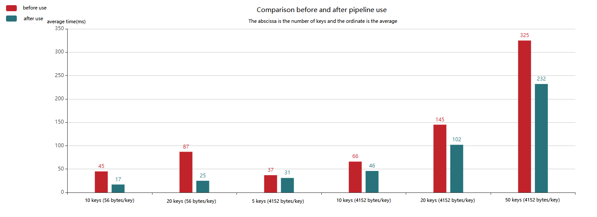

# Use pipeline to optimize performance and memory usage

## 1. Time-consuming analysis of request and response

A complete request response that the time consumption is mainly divided into 3 parts：

1. Link creation and recycling

2. network IO

3. Command actual time

example:

Need to query the details of 100 userIds

Conventional practice: traverse 100 keys, loop query, assemble data and return

Recommended practice: mget, pipeline batch acquisition

mget, pipeline saves the time of link creation and recycling, network IO

## 2. Redis cluster pipeline implementation ideas

mget, pipeline are not applicable to cluster cluster mode

In order to apply batch processing, it needs to be transformed. The ideas are as follows:

* client

  Calculate the slot where the key falls, and then according to the relationship between the slot and the node, you can get which node the key belongs to, and then each node opens the pipeline to execute the command

* Server

  The key is sent to a node, if the key belongs to this node, it will return the value; if it does not belong, it will return the redirection information

* the key itself

  Through HashTag, you can set yourself to map the same type of key to the same instance

  

## 3. Performance comparison before and after pipeline use

